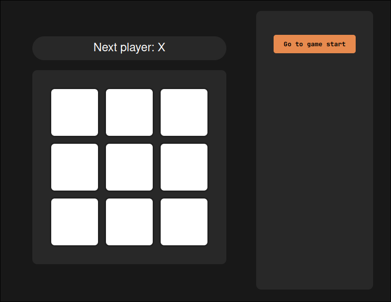
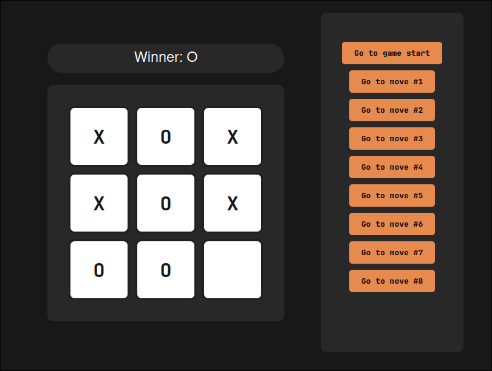

<div align="center">
    <h1 align="center">React Tic-Tac-Toe</h1>
    <p align="center">
Modern and beautifully styled implementation of the classic Tic-Tac-Toe game
    </p>
</div>

</br>


## 🕹️ Preview

This project presents a modern and beautifully styled implementation of the classic Tic-Tac-Toe game. While its core logic is based on the foundational concepts from the official React tutorial, this version emphasizes a clean user interface and a polished user experience with a custom dark theme.





## 🕹️ Online Preview

This project can be played as multiplayer throw a websocket conection and getting in by diferents clients.


You have to run backend server by this repository: https://github.com/Andr3xDev/ARSW-TicTacBack

</br>
</br>

## ✨ Key Features

* Complete Game Logic: All the core functionalities are here, including detecting a winner, tracking players' moves, and the ability to go back to previous moves.
* Custom Styling & Dark Mode: Features a unique and visually appealing interface with a sleek dark theme, offering a significant visual upgrade over standard tutorial styles.
* Modern & Fast Development Environment: Built using a modern tech stack with Vite, ensuring a fast and responsive development experience with Hot Module Replacement (HMR) and an optimized build process.
* Interactive History: Jump to any previous move in the game's history to review the board state at that point.

</br>
</br>

## 🛠️ Tech Stack

- React: For building a declarative and component-based user interface.
- JavaScript: For the component logic.
- CSS: For the custom styling and layout.
- Vite: As the build tool and development server.

</br>
</br>

## 🚀 Getting Started

Follow these steps to get the project running on your local machine.

### Prerequisites
Ensure you have Node.js installed (LTS version is recommended).

### Installation

Clone the repository:

```sh
git clone https://github.com/Andr3xDev/ARSW-tic-tac-toe.git
```

Navigate to the project directory:

```sh
cd ARSW-tic-tac-toe
npm install
npm run dev
```

Open http://localhost:5173 (or the port specified by Vite in your terminal) in your browser to see the app.
